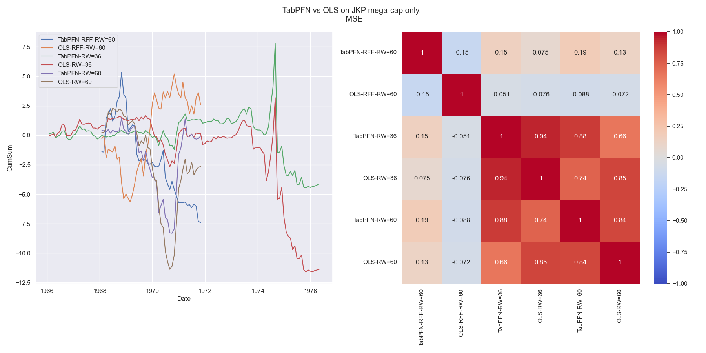

# Description

This repository applies TabPFN [1, 2, 3] to a subset of the JKP dataset [3, 4] containing only mega-cap stocks.

# Results

For comparison, an OLS model minimizing $\|R_{t+1} - f(X_t)\|^2_2$ is used.

# References

[1] Hollmann, Noah, et al. "Tabpfn: A transformer that solves small tabular classification problems in a second." arXiv preprint arXiv:2207.01848 (2022).  
[2] Hollmann, N., Müller, S., Purucker, L., Krishnakumar, A., Körfer, M., Hoo, S. B., ... & Hutter, F. (2025). Accurate predictions on small data with a tabular foundation model. Nature, 637(8045), 319-326.  
[3] https://colab.research.google.com/drive/154SoIzNW1LHBWyrxNwmBqtFAr1uZRZ6a#scrollTo=yuroprV0o6dl  
[3] Jensen, T. I., Kelly, B., & Pedersen, L. H. (2023). Is there a replication crisis in finance?. The Journal of Finance, 78(5), 2465-2518.  
[4] https://jkpfactors.com/
